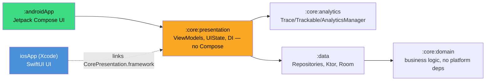
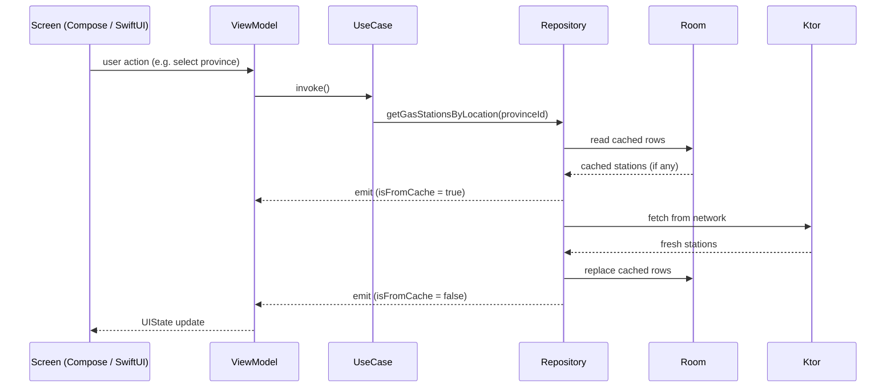

# Fuelio

[](https://github.com/germanbustamante/Fuelio-KMP/actions/workflows/ci.yml)
[](https://github.com/germanbustamante/Fuelio-KMP/actions/workflows/release.yml)

A gas-station finder built with Kotlin Multiplatform: shared domain/data/presentation logic in
Kotlin, **native UI on each platform** — Jetpack Compose on Android, SwiftUI on iOS. See
[`docs/adr/`](./docs/adr) for the architectural decisions behind that split, and `CLAUDE.md` for the
full module-by-module reference.

## Why KMP + native UI, not Compose Multiplatform

Sharing business logic across platforms while keeping each UI 100% native is a deliberate,
documented pivot — the project started on Compose Multiplatform for iOS too, and that UI layer was
thrown away in favor of SwiftUI once it became clear that's what the job market and the platforms'
own tooling actually reward. See [ADR 0001](./docs/adr/0001-kmp-with-native-ui-instead-of-compose-multiplatform.md)
for the full reasoning, and the table below for every decision that followed from it.

| ADR | Decision |
|---|---|
| [0001](./docs/adr/0001-kmp-with-native-ui-instead-of-compose-multiplatform.md) | KMP with native UI (SwiftUI + Compose) instead of Compose Multiplatform |
| [0002](./docs/adr/0002-core-presentation-module-without-compose.md) | `:core:presentation` holds ViewModels/state with zero Compose dependency |
| [0003](./docs/adr/0003-shared-design-tokens-in-kotlin.md) | Design tokens (color/spacing/type) live in Kotlin, adapted natively per platform |
| [0004](./docs/adr/0004-kotlin-swift-interop-libraries.md) | SKIE + KMP-NativeCoroutines + KMP-ObservableViewModel for the Swift bridge |
| [0005](./docs/adr/0005-preferences-and-favorites-persistence.md) | DataStore preferences and a dedicated favourites table (not a column) |
| [0006](./docs/adr/0006-ci-pipeline-and-screenshot-testing.md) | CI scope, job split, and Roborazzi screenshot testing |
| [0007](./docs/adr/0007-koin-over-hilt.md) | Koin over Hilt (Hilt isn't multiplatform) |
| [0008](./docs/adr/0008-ktor-over-retrofit.md) | Ktor over Retrofit, engine selection via `expect`/`actual` |
| [0009](./docs/adr/0009-release-pipeline-and-versioning.md) | Branch model, version as a single source of truth, release pipeline |

## Modules



`:core:presentation` (highlighted above) is the module exported as a Kotlin/Native framework
(`CorePresentation.framework`) for Xcode to link — it has zero Compose/Navigation3 dependencies by
design (see [ADR 0002](./docs/adr/0002-core-presentation-module-without-compose.md)).

## Architecture: one request, both platforms

Both UIs drive the exact same path from tap to pixel — only the last arrow changes per platform:



That's **stale-while-revalidate**: cached rows render immediately if any exist, then the network
result replaces them — up to two emissions per request, never zero even offline with a warm cache. A
failed refresh with content already on screen becomes a transient stale-data notice, not a blocking
error, so a flaky network never blanks out data the user can already see.

## Setup

Two configuration files are **gitignored**, so a fresh clone will not have them. The build works
without both — the map renders empty, PostHog stays off and release signing is skipped — but you
will want at least the first to see the map.

**`thirdparties.properties`** (repo root) holds third-party API keys:

```properties
MAPS_API_KEY=AIza…       # Google Maps SDK, used as an Android manifest placeholder
POSTHOG_API_KEY=phc_…    # optional; blank or missing simply keeps PostHog disabled
```

Both also fall back to environment variables of the same name, which is how CI supplies them.

**`androidApp/keystore.properties`** is only needed to build a signed release:

```properties
storeFile=/absolute/path/to/fuelio.jks
storePassword=…
keyAlias=…
keyPassword=…
```

Absent, `assembleRelease` still builds — it just falls back to the debug signing config.

`google-services.json` is committed, so Firebase needs no setup.

## Build and run — Android

```shell
./gradlew :androidApp:assembleDebug
./gradlew :androidApp:installDebug
```

Or use the run configuration from the IDE's toolbar.

## Build and run — iOS

Open [`iosApp/iosApp.xcodeproj`](./iosApp/iosApp.xcodeproj) in Xcode and run from there. The
"Compile Kotlin Framework" build phase invokes
`./gradlew :core:presentation:embedAndSignAppleFrameworkForXcode` automatically, so no manual Gradle
step is needed first.

Swift dependencies come in via Swift Package Manager (no CocoaPods): Firebase, PostHog, and the Swift
halves of the two interop libraries — `KMPObservableViewModelSwiftUI` and `KMPNativeCoroutinesAsync`.
Those two are pinned to the exact versions of their Gradle counterparts; the halves are released in
lockstep and a mismatch fails at link time. See
[`docs/adr/0004-kotlin-swift-interop-libraries.md`](./docs/adr/0004-kotlin-swift-interop-libraries.md)
for what each library covers.

Note that SKIE roughly triples the framework link step, so a cold iOS build is noticeably slower than
the Kotlin-only tasks suggest.

From the command line:

```shell
xcodebuild build -project iosApp/iosApp.xcodeproj -scheme iosApp \
  -destination 'platform=iOS Simulator,name=iPhone 17,OS=latest'
```

To sanity-check the framework outside Xcode — and to regenerate the Objective-C header, which is the
source of truth for every Kotlin symbol Swift can see:

```shell
./gradlew :core:presentation:linkDebugFrameworkIosSimulatorArm64
open core/presentation/build/bin/iosSimulatorArm64/debugFramework/CorePresentation.framework/Headers/CorePresentation.h
```

## Tests

Test count is a portfolio metric here, not a vanity number — it's evidence the ViewModel-per-screen,
Repository, and navigation-mapping layers are each independently verifiable:

| Layer | Count | What it covers |
|---|---|---|
| Kotlin (`@Test`, all KMP modules + `androidApp`) | 362 | Domain use cases, repository stale-while-revalidate paths, ViewModels, DI wiring, navigation mapping, Compose instrumentation |
| Swift Testing (`iosAppTests`) | 64 | Sealed-type mapping, design-token parity, localization, deep-link/route mapping, interop integration |
| XCUITest (`iosAppUITests`) | 26 | Onboarding, location permission, favourites, and full user flows end to end |

Every KMP module's `commonTest` runs on the JVM (`testAndroidHostTest`) as well as the iOS simulator
(`iosSimulatorArm64Test`) — see [ADR 0006](./docs/adr/0006-ci-pipeline-and-screenshot-testing.md) for
why that split exists and what it cost to get `:core:domain`/`:core:analytics` onto Linux runners.

### Kotlin

```shell
./gradlew :androidApp:testDebugUnitTest              # Compose-dependent code (designsystem, screens)
# Every KMP module's commonTest runs on the JVM as well as on the simulator. The host tasks are the
# fast loop (and what CI runs on Linux); the simulator tasks additionally cover each module's
# iosTest source set.
./gradlew :core:domain:testAndroidHostTest
./gradlew :core:analytics:testAndroidHostTest
./gradlew :data:testAndroidHostTest
./gradlew :core:presentation:testAndroidHostTest      # ViewModel/state/navigation tests, JVM

./gradlew :core:presentation:iosSimulatorArm64Test    # Same tests + the iOS DI factory, simulator target
./gradlew :core:domain:iosSimulatorArm64Test
./gradlew :data:iosSimulatorArm64Test
./gradlew :core:analytics:iosSimulatorArm64Test
```

### Screenshots

```shell
./gradlew :androidApp:verifyRoborazziDebug    # compare against the committed goldens (CI runs this)
./gradlew :androidApp:recordRoborazziDebug    # re-record after an intentional visual change
```

Goldens live in `androidApp/src/test/screenshots/` and are committed. They render through Robolectric
at SDK 36 rather than the app's compileSdk of 37 — see
[ADR 0006](./docs/adr/0006-ci-pipeline-and-screenshot-testing.md) for why, and for why the JUnit
vintage engine is a required dependency rather than an optional one.

### Swift

```shell
xcodebuild test -project iosApp/iosApp.xcodeproj -scheme iosApp \
  -destination 'platform=iOS Simulator,name=iPhone 17,OS=latest'

# One target at a time
xcodebuild test … -only-testing:iosAppTests      # Swift Testing: mappings, tokens, interop integration
xcodebuild test … -only-testing:iosAppUITests    # XCUITest: list, detail, error and accessibility flows
```

**Always pass `OS=latest`.** A `name=iPhone 17` destination alone is ambiguous when more than one iOS
runtime is installed, and the resulting device contention shows up as
`Application failed preflight checks` rather than as a useful error.

Both test targets run against a deterministic Koin graph: `initKoinIosForUiTests(…)` swaps only the
repositories and the location permission prompt for in-memory fakes, so the real ViewModels,
`Navigator` and analytics are exercised without the network, Room or a system dialog. UI tests opt in
with the `-UITestMode` launch argument (`-UITestFailure` to reach the error state); unit tests are
detected automatically, since they are hosted by the app. None of it is compiled into release builds.

## Known gaps

- **iOS brand logos**: `BrandLogo` derives an asset name from the shared Kotlin `GasStationBrand`
  enum (e.g. `REPSOL` → `logo_repsol`), matching Android's 16 vector drawables one for one. No iOS
  artwork exists yet, so every brand renders the `fuelpump.fill` SF Symbol fallback — a design asset
  gap, not a code gap; dropping correctly named images into `Assets.xcassets` needs no code change.

---

Learn more about [Kotlin Multiplatform](https://www.jetbrains.com/help/kotlin-multiplatform-dev/get-started.html)…
